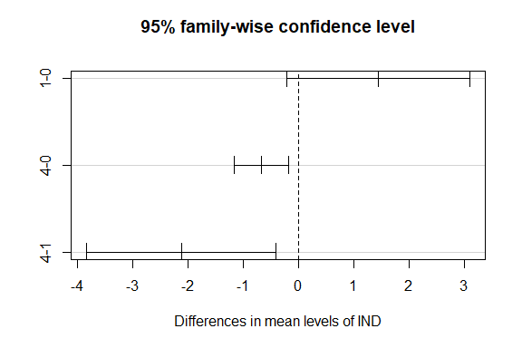

Wind Speed Prediction
================
Trevor Okinda
2024

- [Student Details](#student-details)
- [Setup Chunk](#setup-chunk)
  - [Source:](#source)
  - [Reference:](#reference)
- [Understanding the Dataset (Exploratory Data Analysis
  (EDA))](#understanding-the-dataset-exploratory-data-analysis-eda)
  - [Loading the Dataset](#loading-the-dataset)
  - [Measures of Frequency](#measures-of-frequency)
  - [Measures of Central Tendency](#measures-of-central-tendency)
  - [Measures of Distribution](#measures-of-distribution)
  - [Measures of Relationship](#measures-of-relationship)
  - [ANOVA](#anova)
  - [Plots](#plots)
- [Preprocessing and Data
  Transformation](#preprocessing-and-data-transformation)
  - [Missing Values](#missing-values)
  - [Clean Dataset](#clean-dataset)
- [Training Model](#training-model)
  - [Data Splitting](#data-splitting)
  - [Bootstrapping](#bootstrapping)
  - [Cross-validation](#cross-validation)
  - [Training Different Models](#training-different-models)
  - [Evaluate Models Performance](#evaluate-models-performance)

# Student Details

|                       |                      |
|-----------------------|----------------------|
| **Student ID Number** | 134780               |
| **Student Name**      | Trevor Okinda        |
| **BBIT 4.2 Group**    | C                    |
| **Project Name**      | Windspeed Prediction |

# Setup Chunk

**Note:** the following KnitR options have been set as the global
defaults: <BR>
`knitr::opts_chunk$set(echo = TRUE, warning = FALSE, eval = TRUE, collapse = FALSE, tidy = TRUE)`.

More KnitR options are documented here
<https://bookdown.org/yihui/rmarkdown-cookbook/chunk-options.html> and
here <https://yihui.org/knitr/options/>.

### Source:

The dataset that was used can be downloaded here: *\<<a
href="https://www.kaggle.com/datasets/fedesoriano/wind-speed-prediction-dataset\"
class="uri">https://www.kaggle.com/datasets/fedesoriano/wind-speed-prediction-dataset\</a>\>*

### Reference:

*\<fedesoriano. (n.d.). Wind Speed Prediction Dataset \[Data set\].
Kaggle. <a
href="https://www.kaggle.com/datasets/fedesoriano/wind-speed-prediction-dataset\"
class="uri">https://www.kaggle.com/datasets/fedesoriano/wind-speed-prediction-dataset\</a>\>  
Refer to the APA 7th edition manual for rules on how to cite datasets:
<https://apastyle.apa.org/style-grammar-guidelines/references/examples/data-set-references>*

# Understanding the Dataset (Exploratory Data Analysis (EDA))

## Loading the Dataset

``` r
# Load the dataset
WeatherData <- read.csv("wind_dataset.csv", colClasses = c(
  IND = "factor",
  RAIN = "numeric",
  IND_1 = "factor",
  T_MAX = "numeric",
  IND_2 = "factor",
  T_MIN = "numeric",
  WIND = "numeric"
))

# Display structure to verify data types
str(WeatherData)
```

    ## 'data.frame':    6574 obs. of  7 variables:
    ##  $ IND  : Factor w/ 3 levels "0","1","4": 1 1 1 1 1 1 1 1 1 1 ...
    ##  $ RAIN : num  0.2 5.1 0.4 0.2 10.4 0 1.9 0 8.3 0 ...
    ##  $ IND_1: Factor w/ 5 levels "","0","1","2",..: 2 2 2 2 2 2 2 2 2 2 ...
    ##  $ T_MAX: num  9.5 7.2 5.5 5.6 7.2 6.5 9.2 6.6 6.8 6.5 ...
    ##  $ IND_2: Factor w/ 6 levels "","0","1","2",..: 2 2 2 2 3 2 3 2 2 2 ...
    ##  $ T_MIN: num  3.7 4.2 0.5 0.4 -1.5 1.2 -2.4 3.1 2.4 3 ...
    ##  $ WIND : num  13.67 11.5 11.25 8.63 11.92 ...

``` r
# Display first few rows to ensure data is loaded correctly
head(WeatherData)
```

    ##   IND RAIN IND_1 T_MAX IND_2 T_MIN  WIND
    ## 1   0  0.2     0   9.5     0   3.7 13.67
    ## 2   0  5.1     0   7.2     0   4.2 11.50
    ## 3   0  0.4     0   5.5     0   0.5 11.25
    ## 4   0  0.2     0   5.6     0   0.4  8.63
    ## 5   0 10.4     0   7.2     1  -1.5 11.92
    ## 6   0  0.0     0   6.5     0   1.2 10.67

``` r
# View the dataset in a spreadsheet-like interface (optional)
View(WeatherData)
```

## Measures of Frequency

``` r
# Load necessary libraries
library(psych)   # For descriptive statistics
library(corrplot) # For visualizing relationships
```

    ## corrplot 0.95 loaded

``` r
# Measures of Frequency
# Frequency distribution of categorical variables
freq_IND <- table(WeatherData$IND)
freq_IND_1 <- table(WeatherData$IND_1)
freq_IND_2 <- table(WeatherData$IND_2)

cat("Frequency distribution for IND:\n")
```

    ## Frequency distribution for IND:

``` r
print(freq_IND)
```

    ## 
    ##    0    1    4 
    ## 5893   50  631

``` r
cat("Frequency distribution for IND_1:\n")
```

    ## Frequency distribution for IND_1:

``` r
print(freq_IND_1)
```

    ## 
    ##         0    1    2    4 
    ##   61 5912    1   40  560

``` r
cat("Frequency distribution for IND_2:\n")
```

    ## Frequency distribution for IND_2:

``` r
print(freq_IND_2)
```

    ## 
    ##         0    1    2    3    4 
    ##   61 5352  525   21    2  613

## Measures of Central Tendency

``` r
# Measures of Central Tendency
# Mean, Median, and Mode (mode is approximated as the most frequent value for simplicity)
mean_RAIN <- mean(WeatherData$RAIN, na.rm = TRUE)
median_RAIN <- median(WeatherData$RAIN, na.rm = TRUE)
mode_RAIN <- as.numeric(names(sort(table(WeatherData$RAIN), decreasing = TRUE))[1])

cat("Mean of RAIN:", mean_RAIN, "\n")
```

    ## Mean of RAIN: 1.885169

``` r
cat("Median of RAIN:", median_RAIN, "\n")
```

    ## Median of RAIN: 0.2

``` r
cat("Mode of RAIN:", mode_RAIN, "\n")
```

    ## Mode of RAIN: 0

## Measures of Distribution

``` r
# Measures of Distribution
# Standard deviation, variance, range
sd_RAIN <- sd(WeatherData$RAIN, na.rm = TRUE)
var_RAIN <- var(WeatherData$RAIN, na.rm = TRUE)
range_RAIN <- range(WeatherData$RAIN, na.rm = TRUE)

cat("Standard deviation of RAIN:", sd_RAIN, "\n")
```

    ## Standard deviation of RAIN: 4.030529

``` r
cat("Variance of RAIN:", var_RAIN, "\n")
```

    ## Variance of RAIN: 16.24516

``` r
cat("Range of RAIN:", paste(range_RAIN, collapse = " - "), "\n")
```

    ## Range of RAIN: 0 - 67

## Measures of Relationship

``` r
# Measures of Relationship
# Correlation matrix for numeric variables
numeric_vars <- WeatherData[, sapply(WeatherData, is.numeric)]
cor_matrix <- cor(numeric_vars, use = "complete.obs")

cat("Correlation matrix:\n")
```

    ## Correlation matrix:

``` r
print(cor_matrix)
```

    ##              RAIN       T_MAX       T_MIN       WIND
    ## RAIN   1.00000000 -0.04418919  0.01109613  0.1178895
    ## T_MAX -0.04418919  1.00000000  0.78998042 -0.2462604
    ## T_MIN  0.01109613  0.78998042  1.00000000 -0.0929965
    ## WIND   0.11788945 -0.24626037 -0.09299650  1.0000000

``` r
# Visualize the correlation matrix
corrplot(cor_matrix, method = "color", type = "upper", tl.col = "black", tl.srt = 45)
```

<!-- -->

## ANOVA

``` r
# Perform ANOVA on WIND by IND
anova_result <- aov(WIND ~ IND, data = WeatherData)

# Display ANOVA summary
summary(anova_result)
```

    ##               Df Sum Sq Mean Sq F value   Pr(>F)    
    ## IND            2    372  185.83   7.516 0.000549 ***
    ## Residuals   6571 162463   24.72                     
    ## ---
    ## Signif. codes:  0 '***' 0.001 '**' 0.01 '*' 0.05 '.' 0.1 ' ' 1

``` r
# Post-hoc test to identify pairwise differences (if applicable)
# Using Tukey's HSD test for multiple comparisons
tukey_result <- TukeyHSD(anova_result)

# Display Tukey's HSD results
print(tukey_result)
```

    ##   Tukey multiple comparisons of means
    ##     95% family-wise confidence level
    ## 
    ## Fit: aov(formula = WIND ~ IND, data = WeatherData)
    ## 
    ## $IND
    ##           diff        lwr        upr     p adj
    ## 1-0  1.4477876 -0.2076457  3.1032209 0.1005491
    ## 4-0 -0.6729163 -1.1611594 -0.1846732 0.0035505
    ## 4-1 -2.1207040 -3.8332250 -0.4081829 0.0103645

``` r
# Visualize the differences
plot(tukey_result)
```

<!-- -->

``` r
# Optionally perform ANOVA for another categorical variable (e.g., IND_1)
anova_result_2 <- aov(WIND ~ IND_1, data = WeatherData)
summary(anova_result_2)
```

    ##               Df Sum Sq Mean Sq F value   Pr(>F)    
    ## IND_1          4    956  238.93   9.696 8.13e-08 ***
    ## Residuals   6569 161879   24.64                     
    ## ---
    ## Signif. codes:  0 '***' 0.001 '**' 0.01 '*' 0.05 '.' 0.1 ' ' 1

## Plots

``` r
# Load necessary libraries
library(ggplot2)
```

    ## 
    ## Attaching package: 'ggplot2'

    ## The following objects are masked from 'package:psych':
    ## 
    ##     %+%, alpha

``` r
# Univariate Plots

# Histogram for a numeric variable (e.g., WIND)
ggplot(WeatherData, aes(x = WIND)) +
  geom_histogram(binwidth = 1, fill = "blue", color = "black") +
  labs(title = "Distribution of Wind Speed", x = "Wind Speed", y = "Frequency") +
  theme_minimal()
```

<!-- -->

``` r
# Boxplot for a numeric variable (e.g., WIND)
ggplot(WeatherData, aes(y = WIND)) +
  geom_boxplot(fill = "cyan", color = "black") +
  labs(title = "Boxplot of Wind Speed", y = "Wind Speed") +
  theme_minimal()
```

<!-- -->

``` r
# Bar chart for a categorical variable (e.g., IND)
ggplot(WeatherData, aes(x = IND)) +
  geom_bar(fill = "orange", color = "black") +
  labs(title = "Frequency of IND Categories", x = "IND", y = "Count") +
  theme_minimal()
```

<!-- -->

``` r
# Multivariate Plots

# Scatter plot of WIND vs. T_MAX, colored by IND
ggplot(WeatherData, aes(x = T_MAX, y = WIND, color = IND)) +
  geom_point() +
  labs(title = "Scatter Plot of Wind Speed vs. Max Temperature", 
       x = "Max Temperature", y = "Wind Speed") +
  theme_minimal()
```

<!-- -->

``` r
# Boxplot of WIND grouped by IND
ggplot(WeatherData, aes(x = IND, y = WIND)) +
  geom_boxplot(fill = "lightblue", color = "black") +
  labs(title = "Wind Speed by IND Categories", x = "IND", y = "Wind Speed") +
  theme_minimal()
```

<!-- -->

``` r
# Correlation heatmap for numeric variables
library(reshape2)
numeric_vars <- WeatherData[, sapply(WeatherData, is.numeric)]
cor_matrix <- cor(numeric_vars, use = "complete.obs")
cor_melted <- melt(cor_matrix)

ggplot(cor_melted, aes(x = Var1, y = Var2, fill = value)) +
  geom_tile() +
  scale_fill_gradient2(low = "blue", high = "red", mid = "white", midpoint = 0) +
  labs(title = "Correlation Heatmap", x = "Variables", y = "Variables") +
  theme_minimal() +
  theme(axis.text.x = element_text(angle = 45, hjust = 1))
```

<!-- -->

# Preprocessing and Data Transformation

## Missing Values

``` r
# Check for missing values in the entire dataset
missing_values <- colSums(is.na(WeatherData))

# Display the count of missing values for each column
cat("Missing values in each column:\n")
```

    ## Missing values in each column:

``` r
print(missing_values)
```

    ##   IND  RAIN IND_1 T_MAX IND_2 T_MIN  WIND 
    ##     0     0     0   621     0   674     0

``` r
# Check if the dataset has any missing values at all
if (sum(missing_values) > 0) {
  cat("Total missing values in the dataset:", sum(missing_values), "\n")
} else {
  cat("No missing values in the dataset.\n")
}
```

    ## Total missing values in the dataset: 1295

``` r
# Optionally, display rows with missing values
rows_with_na <- WeatherData[!complete.cases(WeatherData), ]
cat("Rows with missing values:\n")
```

    ## Rows with missing values:

``` r
print(rows_with_na)
```

    ##      IND RAIN IND_1 T_MAX IND_2 T_MIN  WIND
    ## 731    0  0.0     4    NA     4    NA 23.45
    ## 732    0  3.9     4    NA     4    NA 20.75
    ## 733    0 12.5     4    NA     4    NA 13.83
    ## 734    0  6.4     4    NA     4    NA  8.54
    ## 735    0  1.2     4    NA     4    NA 13.08
    ## 736    0  0.0     4    NA     4    NA 20.91
    ## 737    0  0.0     4    NA     4    NA 16.75
    ## 738    0  0.0     4    NA     4    NA 16.83
    ## 739    0  0.0     4    NA     4    NA 21.67
    ## 740    0  0.0     4    NA     4    NA 19.38
    ## 741    0  0.0     4    NA     4    NA  9.79
    ## 742    0  6.0     4    NA     4    NA  3.96
    ## 743    0  0.0     4    NA     4    NA  5.21
    ## 744    0  0.0     4    NA     4    NA 10.46
    ## 745    0  3.6     4    NA     4    NA  9.17
    ## 746    0  0.1     4    NA     4    NA 12.58
    ## 747    0  0.0     4    NA     4    NA 15.37
    ## 748    0  0.0     4    NA     4    NA 21.50
    ## 749    0  0.0     4    NA     4    NA 23.79
    ## 750    0  0.8     4    NA     4    NA 19.62
    ## 751    0  0.0     4    NA     4    NA 13.83
    ## 752    0  0.0     4    NA     4    NA 11.92
    ## 753    0  0.0     4    NA     4    NA  2.17
    ## 754    0  0.0     4    NA     4    NA  3.04
    ## 755    0  0.0     4    NA     4    NA  8.92
    ## 756    0  0.0     4    NA     4    NA  8.38
    ## 757    0  0.0     4    NA     4    NA  1.63
    ## 758    0  0.0     4    NA     4    NA  1.33
    ## 759    0  7.6     4    NA     4    NA  7.41
    ## 760    0  0.6     4    NA     4    NA 19.62
    ## 761    0  1.3     4    NA     4    NA 11.83
    ## 762    0  0.4     4    NA     4    NA 14.04
    ## 763    0  0.6     4    NA     4    NA 15.16
    ## 764    0  0.2     4    NA     4    NA  8.67
    ## 765    0  7.0     4    NA     4    NA  9.13
    ## 766    0 32.0     4    NA     4    NA 22.00
    ## 767    0 12.0     4    NA     4    NA 20.25
    ## 768    0  0.0     4    NA     4    NA 11.83
    ## 769    0  0.7     4    NA     4    NA 10.37
    ## 770    0  5.3     4    NA     4    NA 16.88
    ## 771    0  0.0     4    NA     4    NA 15.67
    ## 772    0  0.0     4    NA     4    NA  6.79
    ## 773    0  0.0     4    NA     4    NA  5.21
    ## 774    0  7.2     4    NA     4    NA 12.83
    ## 775    0  6.3     4    NA     4    NA 19.17
    ## 776    0  0.0     4    NA     4    NA 15.50
    ## 777    0  0.0     4    NA     4    NA 13.54
    ## 778    0  0.0     4    NA     4    NA  7.83
    ## 779    0  0.0     4    NA     4    NA 10.34
    ## 780    0  0.0     4    NA     4    NA 14.54
    ## 781    0  0.0     4    NA     4    NA  9.92
    ## 782    0  0.0     4    NA     4    NA  8.50
    ## 783    0  0.0     4    NA     4    NA  5.50
    ## 784    0  0.0     4    NA     4    NA  9.33
    ## 785    0  0.0     4    NA     4    NA 13.75
    ## 786    0  0.0     4    NA     4    NA 11.46
    ## 787    0  0.0     4    NA     4    NA 19.25
    ## 788    0  0.0     4    NA     4    NA 12.50
    ## 789    0  0.0     4    NA     4    NA 16.46
    ## 821    0  2.2     4    NA     4    NA 11.79
    ## 822    0  0.0     4    NA     4    NA  8.96
    ## 823    0  0.2     4    NA     4    NA  8.71
    ## 824    0  4.3     4    NA     4    NA 13.00
    ## 825    0  7.2     4    NA     4    NA 20.04
    ## 826    0  1.8     4    NA     4    NA 20.50
    ## 827    0  0.0     4    NA     4    NA 18.50
    ## 828    0  0.3     4    NA     4    NA 10.41
    ## 829    0  1.1     4    NA     4    NA 11.67
    ## 830    0  1.2     4    NA     4    NA  7.25
    ## 831    0  0.0     4    NA     4    NA  9.54
    ## 832    0  0.0     4    NA     4    NA 16.00
    ## 833    0 10.1     4    NA     4    NA 15.21
    ## 834    0  2.7     4    NA     4    NA 16.46
    ## 835    0  1.1     4    NA     4    NA  8.87
    ## 836    0  0.0     4    NA     4    NA  9.67
    ## 837    0  0.0     4    NA     4    NA  8.00
    ## 838    0  1.1     4    NA     4    NA  9.92
    ## 839    1  5.8     4    NA     4    NA  9.50
    ## 840    0  1.7     4    NA     4    NA 21.54
    ## 841    0  4.4     4    NA     4    NA 19.58
    ## 842    0  0.0     4    NA     4    NA 13.42
    ## 843    0  0.2     4    NA     4    NA  6.00
    ## 844    0  0.2     4    NA     4    NA  6.67
    ## 845    0  0.0     4    NA     4    NA  4.83
    ## 846    0  0.6     4    NA     4    NA  5.71
    ## 847    0  0.1     4    NA     4    NA 12.12
    ## 848    0  0.2     4    NA     4    NA 11.42
    ## 849    0  0.0     4    NA     4    NA 11.75
    ## 850    0  1.1     4    NA     4    NA 12.33
    ## 882    0  0.0     4    NA     4    NA 10.92
    ## 883    0  0.0     4    NA     4    NA 14.46
    ## 884    0  0.0     4    NA     4    NA 17.67
    ## 885    0  0.2     4    NA     4    NA  9.79
    ## 886    0  0.0     4    NA     4    NA  6.00
    ## 887    0  0.0     4    NA     4    NA  6.29
    ## 888    0  0.0     4    NA     4    NA  3.58
    ## 889    0  0.0     4    NA     4    NA  4.25
    ## 890    0  0.0     4    NA     4    NA  8.38
    ## 891    0  0.0     4    NA     4    NA  5.75
    ## 892    0 18.8     4    NA     4    NA  2.92
    ## 893    0  5.0     4    NA     4    NA  4.25
    ## 894    0  0.0     4    NA     4    NA  4.92
    ## 895    0  0.0     4    NA     4    NA  4.83
    ## 896    0  5.0     4    NA     4    NA  7.17
    ## 897    0  0.8     4    NA     4    NA  8.29
    ## 898    0  4.5     4    NA     4    NA  5.88
    ## 899    0  0.8     4    NA     4    NA 17.83
    ## 900    0  3.3     4    NA     4    NA  8.92
    ## 901    0  0.1     4    NA     4    NA  8.67
    ## 902    0  0.5     4    NA     4    NA 10.34
    ## 903    0  6.3     4    NA     4    NA 11.83
    ## 904    0  0.3     4    NA     4    NA 11.87
    ## 905    0  2.8     4    NA     4    NA 12.04
    ## 906    0  3.1     4    NA     4    NA  8.17
    ## 907    0  3.5     4    NA     4    NA 12.71
    ## 908    0  3.0     4    NA     4    NA 13.04
    ## 909    0  3.4     4    NA     4    NA 12.17
    ## 910    0  2.8     4    NA     4    NA 13.50
    ## 911    0  0.5     4    NA     4    NA 11.58
    ## 974    0  0.5     4    NA     4    NA 10.34
    ## 975    0  1.3     4    NA     4    NA  8.96
    ## 976    0  2.8     4    NA     4    NA 11.25
    ## 977    0  0.0     4    NA     4    NA  5.96
    ## 978    0  6.8     4    NA     4    NA  9.25
    ## 979    0  6.9     4    NA     4    NA 10.34
    ## 980    0  2.0     4    NA     4    NA 14.67
    ## 981    0  1.2     4    NA     4    NA 13.13
    ## 982    0  0.3     4    NA     4    NA 14.04
    ## 983    0  0.0     4    NA     4    NA  3.71
    ## 984    0  0.0     4    NA     4    NA  2.54
    ## 985    0  0.0     4    NA     4    NA  4.29
    ## 986    0  0.0     4    NA     4    NA  9.79
    ## 987    0  0.0     4    NA     4    NA  9.33
    ## 988    0  0.0     4    NA     4    NA  5.91
    ## 989    0  0.0     4    NA     4    NA  4.75
    ## 990    0  5.6     4    NA     4    NA  7.83
    ## 991    0  0.0     4    NA     4    NA  5.41
    ## 992    0  0.2     4    NA     4    NA  6.75
    ## 993    0  0.0     4    NA     4    NA  5.50
    ## 994    0  0.0     4    NA     4    NA  2.54
    ## 995    0  0.0     4    NA     4    NA  3.21
    ## 996    0  2.0     4    NA     4    NA  5.09
    ## 997    0  1.3     4    NA     4    NA 14.67
    ## 998    0 15.8     4    NA     4    NA 13.37
    ## 999    0  0.0     4    NA     4    NA 23.04
    ## 1000   0  0.0     4    NA     4    NA 15.00
    ## 1001   0  0.3     4    NA     4    NA 10.17
    ## 1002   0  0.0     4    NA     4    NA 17.88
    ## 1003   0  0.2     4    NA     4    NA 12.50
    ## 1004   0  0.9     4    NA     4    NA 15.71
    ## 1005   0  1.2     4    NA     4    NA 10.54
    ## 1006   0  2.0     4    NA     4    NA 14.21
    ## 1007   0  1.5     4    NA     4    NA 14.25
    ## 1008   0  2.4     4    NA     4    NA  9.04
    ## 1009   0  5.1     4    NA     4    NA  8.71
    ## 1010   0  0.0     4    NA     4    NA 11.17
    ## 1011   0  0.4     4    NA     4    NA 14.33
    ## 1012   0  0.0     4    NA     4    NA 15.25
    ## 1013   0  0.0     4    NA     4    NA 14.42
    ## 1014   0  0.0     4    NA     4    NA  9.83
    ## 1015   0  0.3     4    NA     4    NA  9.42
    ## 1016   0  0.0     4    NA     4    NA 14.21
    ## 1017   0  4.3     4    NA     4    NA  3.83
    ## 1018   0  1.0     4    NA     4    NA 11.67
    ## 1019   0  0.0     4    NA     4    NA  7.46
    ## 1020   0  0.0     4    NA     4    NA 10.37
    ## 1021   0  0.0     4    NA     4    NA 12.96
    ## 1022   0  0.2     4    NA     4    NA 15.09
    ## 1023   0  0.0     4    NA     4    NA 13.42
    ## 1024   0  6.3     4    NA     4    NA 13.88
    ## 1025   0  0.4     4    NA     4    NA  9.79
    ## 1026   0  0.0     4    NA     4    NA 12.92
    ## 1027   0  0.0     4    NA     4    NA  4.83
    ## 1028   0  0.0     4    NA     4    NA  6.04
    ## 1029   0  0.0     4    NA     4    NA 11.21
    ## 1030   0  0.1     4    NA     4    NA 15.37
    ## 1031   0  5.4     4    NA     4    NA 12.04
    ## 1032   0  3.0     4    NA     4    NA  8.21
    ## 1033   0  9.6     4    NA     4    NA 15.92
    ## 1034   0  0.2     4    NA     4    NA  5.25
    ## 1035   0  0.5     4    NA     4    NA  8.25
    ## 1036   0 16.2     4    NA     4    NA  6.00
    ## 1037   0  2.0     4    NA     4    NA  7.33
    ## 1038   0  7.9     4    NA     4    NA 16.13
    ## 1039   0  9.8     4    NA     4    NA 11.12
    ## 1040   0  0.2     4    NA     4    NA  3.00
    ## 1041   0  0.0     4    NA     4    NA  7.62
    ## 1042   0  0.0     4    NA     4    NA 13.00
    ## 1043   0 11.2     4    NA     4    NA  6.58
    ## 1044   0  7.6     4    NA     4    NA 19.83
    ## 1045   0  0.3     4    NA     4    NA 18.29
    ## 1046   0  0.0     4    NA     4    NA 25.92
    ## 1047   0  1.7     4    NA     4    NA 14.42
    ## 1048   0  0.1     4    NA     4    NA 12.08
    ## 1049   0  6.3     4    NA     4    NA  2.92
    ## 1050   0  0.0     4    NA     4    NA  6.29
    ## 1051   0 11.5     4    NA     4    NA 13.75
    ## 1052   0  0.9     4    NA     4    NA 22.50
    ## 1053   0  2.2     4    NA     4    NA 10.08
    ## 1054   0  2.0     4    NA     4    NA  7.17
    ## 1055   0  7.0     4    NA     4    NA 24.71
    ## 1056   0  0.0     4    NA     4    NA 10.21
    ## 1057   0  3.1     4    NA     4    NA 13.17
    ## 1058   0  0.0     4    NA     4    NA 14.62
    ## 1059   0  1.5     4    NA     4    NA 18.41
    ## 1060   0  0.0     4    NA     4    NA 14.42
    ## 1061   0  3.5     4    NA     4    NA  5.91
    ## 1062   0  0.0     4    NA     4    NA 10.41
    ## 1063   0  0.2     4    NA     4    NA  6.46
    ## 1064   0  7.2     4    NA     4    NA  6.42
    ## 1065   0  1.0     4    NA     4    NA 13.79
    ## 1066   0  0.0     4    NA     4    NA 16.00
    ## 1067   0  0.0     4    NA     4    NA 21.29
    ## 1068   0  0.0     4    NA     4    NA 16.08
    ## 1069   0  0.0     4    NA     4    NA 10.71
    ## 1070   0  0.0     4    NA     4    NA 13.21
    ## 1071   0  0.0     4    NA     4    NA  8.92
    ## 1072   0  0.0     4    NA     4    NA  1.83
    ## 1073   0  0.0     4    NA     4    NA  3.46
    ## 1074   0  0.0     4    NA     4    NA 12.17
    ## 1075   0  6.4     4    NA     4    NA 17.54
    ## 1076   0  0.0     4    NA     4    NA 16.96
    ## 1077   0  0.3     4    NA     4    NA 13.04
    ## 1078   0  0.0     4    NA     4    NA  9.08
    ## 1079   0  1.8     4    NA     4    NA  6.50
    ## 1080   0  0.0     4    NA     4    NA  4.92
    ## 1081   0  0.0     4    NA     4    NA  6.42
    ## 1082   0  1.2     4    NA     4    NA  7.50
    ## 1083   0  0.0     4    NA     4    NA 10.58
    ## 1084   0  0.0     4    NA     4    NA  8.38
    ## 1085   0  0.0     4    NA     4    NA 10.88
    ## 1086   0  0.0     4    NA     4    NA  6.63
    ## 1087   0  0.0     4    NA     4    NA 12.08
    ## 1088   0  1.1     4    NA     4    NA 18.08
    ## 1089   0  0.0     4    NA     4    NA 12.21
    ## 1090   0  0.0     4    NA     4    NA  8.29
    ## 1091   0  0.0     4    NA     4    NA 10.54
    ## 1092   0  2.0     4    NA     4    NA 12.87
    ## 1093   0  1.5     4    NA     4    NA 14.29
    ## 1094   0  2.6     4    NA     4    NA 17.29
    ## 1095   0  0.1     4    NA     4    NA 18.29
    ## 1462   0  0.0     4    NA     4    NA 10.25
    ## 1463   0  0.6     4    NA     4    NA  7.79
    ## 1464   4  0.0     4    NA     4    NA  8.63
    ## 1465   4  0.0     4    NA     4    NA  7.71
    ## 1466   4  0.0     4    NA     4    NA  7.62
    ## 1467   0  0.2     4    NA     4    NA 14.79
    ## 1468   0  2.9     4    NA     4    NA 13.17
    ## 1469   0  1.4     4    NA     4    NA 13.21
    ## 1470   0  5.6     4    NA     4    NA 21.84
    ## 1471   0  0.3     4    NA     4    NA 19.62
    ## 1472   0  0.3     4    NA     4    NA 18.12
    ## 1473   0  4.1     4    NA     4    NA 17.21
    ## 1474   0  3.9     4    NA     4    NA 23.45
    ## 1475   0  3.5     4    NA     4    NA 20.12
    ## 1476   0  5.5     4    NA     4    NA 17.08
    ## 1477   0  4.7     4    NA     4    NA 18.84
    ## 1478   0 13.7     4    NA     4    NA 28.50
    ## 1479   4  0.0     4    NA     4    NA 16.96
    ## 1480   0 32.4     4    NA     4    NA 10.63
    ## 1481   0  2.1     4    NA     4    NA 20.12
    ## 1482   0  3.5     4    NA     4    NA 10.63
    ## 1483   0  0.0     4    NA     4    NA 11.34
    ## 1484   0  1.0     4    NA     4    NA  9.92
    ## 1485   0  0.2     4    NA     4    NA  5.58
    ## 1486   0  0.0     4    NA     4    NA  5.50
    ## 1487   0  4.2     4    NA     4    NA  8.87
    ## 1488   0  4.9     4    NA     4    NA  9.33
    ## 1489   0  3.3     4    NA     4    NA 10.29
    ## 1490   0  0.0     4    NA     4    NA 13.29
    ## 1491   0  0.0     4    NA     4    NA 15.09
    ## 1492   0  0.0     4    NA     4    NA 13.88
    ## 1493   0  0.0     4    NA     4    NA  8.63
    ## 1494   0  0.0     4    NA     4    NA  8.83
    ## 1495   0  0.0     4    NA     4    NA  4.21
    ## 1496   0  0.0     4    NA     4    NA  3.63
    ## 1497   0  0.0     4    NA     4    NA  5.66
    ## 1498   0  0.0     4    NA     4    NA  4.79
    ## 1499   0  0.0     4    NA     4    NA  9.38
    ## 1500   0  0.0     4    NA     4    NA  4.79
    ## 1501   0  0.3     4    NA     4    NA  6.00
    ## 1502   0  0.0     4    NA     4    NA  7.29
    ## 1503   0  0.0     4    NA     4    NA 12.87
    ## 1504   0  0.9     4    NA     4    NA 21.04
    ## 1505   4  0.0     4    NA     4    NA 18.63
    ## 1506   0  0.0     4    NA     4    NA  9.29
    ## 1507   0  0.0     4    NA     4    NA  8.33
    ## 1508   0  0.0     4    NA     4    NA  5.88
    ## 1509   4  0.0     4    NA     4    NA  9.42
    ## 1510   4  0.0     4    NA     4    NA  4.25
    ## 1511   4  0.0     4    NA     4    NA 13.46
    ## 1512   0  1.1     4    NA     4    NA 15.92
    ## 1513   0  0.4     4    NA     4    NA 11.83
    ## 1514   0  0.1     4    NA     4    NA 10.00
    ## 1515   0  1.5     4    NA     4    NA  7.41
    ## 1516   0  1.0     4    NA     4    NA 12.42
    ## 1517   0  0.0     4    NA     4    NA  4.79
    ## 1518   0  0.4     4    NA     4    NA 10.83
    ## 1519   0  0.1     4    NA     4    NA  8.46
    ## 1520   0  1.1     4    NA     4    NA 11.00
    ## 1521   0  3.1     4    NA     4    NA 17.33
    ## 1522   0  0.4     4    NA     4    NA  8.79
    ## 1523   0  6.3     4    NA     4    NA 14.83
    ## 1524   0  0.0     4    NA     4    NA 22.46
    ## 1525   0  0.0     4    NA     4    NA 11.54
    ## 1526   0  0.0     4    NA     4    NA  8.46
    ## 1527   0  0.0     4    NA     4    NA 10.63
    ## 1528   0  0.0     4    NA     4    NA  8.46
    ## 1529   0  0.0     4    NA     4    NA  9.33
    ## 1530   0  0.0     4    NA     4    NA 18.34
    ## 1531   0  0.4     4    NA     4    NA 12.42
    ## 1532   0  0.6     4    NA     4    NA 13.17
    ## 1533   4  0.0     4    NA     4    NA  8.58
    ## 1534   0  0.0     4    NA     4    NA  9.21
    ## 1535   0  2.4     4    NA     4    NA 15.92
    ## 1536   0  1.3     4    NA     4    NA 20.30
    ## 1537   0  0.6     4    NA     4    NA  6.63
    ## 1538   0  0.7     4    NA     4    NA 12.96
    ## 1539   0  3.2     4    NA     4    NA  7.12
    ## 1540   0  6.6     4    NA     4    NA 12.58
    ## 1541   0  5.0     4    NA     4    NA 12.08
    ## 1542   0  4.5     4    NA     4    NA  8.38
    ## 1543   0  1.0     4    NA     4    NA 10.50
    ## 1544   0  2.7     4    NA     4    NA 14.04
    ## 1545   0  6.8     4    NA     4    NA 17.12
    ## 1546   0  0.6     4    NA     4    NA 14.04
    ## 1547   4  0.0     4    NA     4    NA 16.66
    ## 1548   0  0.0     4    NA     4    NA  7.41
    ## 1549   0  0.0     4    NA     4    NA  5.71
    ## 1550   0  0.0     4    NA     4    NA 10.83
    ## 1551   0  0.0     4    NA     4    NA 10.67
    ## 1575   0  5.2     4    NA     0   3.2  8.08
    ## 1576   0  0.3     4    NA     4    NA 10.88
    ## 1582   0  1.2     4    NA     4    NA 12.12
    ## 1583   0  1.4     4    NA     4    NA 14.00
    ## 1584   0  3.0     4    NA     4    NA  7.46
    ## 1585   0  3.6     4    NA     4    NA 11.00
    ## 1586   0  1.2     4    NA     4    NA 15.25
    ## 1587   0  4.5     4    NA     4    NA  7.08
    ## 1588   0  1.4     4    NA     4    NA 11.58
    ## 1589   0  6.4     4    NA     4    NA 17.46
    ## 1590   4  0.0     4    NA     4    NA 15.25
    ## 1591   0  0.0     4    NA     4    NA  4.79
    ## 1592   0  0.0     4    NA     4    NA  3.79
    ## 1593   0  0.0     4    NA     4    NA  8.46
    ## 1594   0  0.0     4    NA     4    NA  7.41
    ## 1595   0  0.0     4    NA     4    NA  3.37
    ## 1596   0  1.8     4    NA     4    NA  3.25
    ## 1597   0  1.0     4    NA     4    NA  5.88
    ## 1598   0 10.8     4    NA     4    NA  6.83
    ## 1599   0  0.2     4    NA     4    NA  9.87
    ## 1600   0  0.0     4    NA     4    NA  4.08
    ## 1601   0  6.2     4    NA     4    NA  7.17
    ## 1602   0  4.1     4    NA     4    NA 12.62
    ## 1603   0  1.7     4    NA     4    NA 10.21
    ## 1604   0  0.6     4    NA     4    NA 12.83
    ## 1605   0  4.8     4    NA     4    NA  8.96
    ## 1606   4  0.0     4    NA     4    NA  7.87
    ## 1607   0  0.1     4    NA     4    NA  9.54
    ## 1608   4  0.0     4    NA     4    NA 12.38
    ## 1609   0  0.0     4    NA     4    NA  9.13
    ## 1610   4  0.0     4    NA     4    NA  8.50
    ## 1611   0  0.0     4    NA     4    NA  9.17
    ## 1612   0  0.0     4    NA     4    NA  7.33
    ## 1643   4  0.0     4    NA     4    NA  8.54
    ## 1644   0  0.0     4    NA     4    NA 10.17
    ## 1645   0  0.0     4    NA     4    NA  9.38
    ## 1646   0  0.0     4    NA     4    NA  7.79
    ## 1647   0  0.3     4    NA     4    NA  9.92
    ## 1648   0  1.9     4    NA     4    NA  4.88
    ## 1649   0  0.0     4    NA     4    NA  7.75
    ## 1650   0  0.7     4    NA     4    NA  9.42
    ## 1651   0  0.3     4    NA     4    NA  7.04
    ## 1652   0  0.4     4    NA     4    NA  8.04
    ## 1653   0  0.2     4    NA     4    NA 10.08
    ## 1654   0  8.2     4    NA     4    NA  5.71
    ## 1655   0  6.1     4    NA     4    NA  4.50
    ## 1656   0  0.2     4    NA     4    NA  5.96
    ## 1657   4  0.0     4    NA     4    NA  8.04
    ## 1658   4  0.0     4    NA     4    NA  5.41
    ## 1659   0  0.0     4    NA     4    NA  4.88
    ## 1660   0 18.1     4    NA     4    NA 10.46
    ## 1661   0  0.0     4    NA     4    NA  8.83
    ## 1662   0  1.6     4    NA     4    NA  4.79
    ## 1663   0  9.5     4    NA     4    NA  7.21
    ## 1664   0 12.5     4    NA     4    NA  4.79
    ## 1665   0  4.1     4    NA     4    NA  6.96
    ## 1666   0  8.5     4    NA     4    NA 10.96
    ## 1667   0  0.1     4    NA     4    NA  7.79
    ## 1668   4  0.0     4    NA     4    NA 10.67
    ## 1669   0  2.3     4    NA     4    NA 12.96
    ## 1670   0  5.1     4    NA     4    NA 14.09
    ## 1671   0  0.2     4    NA     4    NA 18.71
    ## 1672   0  0.1     4    NA     4    NA  5.33
    ## 1673   0  0.9     4    NA     4    NA 13.29
    ## 1674   0  6.2     4    NA     4    NA  9.92
    ## 1675   0  6.7     4    NA     4    NA  7.71
    ## 1676   0 15.7     4    NA     4    NA  5.63
    ## 1677   0  0.2     4    NA     4    NA 11.92
    ## 1678   0  0.0     4    NA     4    NA 17.54
    ## 1679   0  2.8     4    NA     4    NA 12.33
    ## 1680   0  0.2     4    NA     4    NA  8.63
    ## 1681   0  0.0     4    NA     4    NA  3.58
    ## 1682   0  0.2     4    NA     4    NA  6.54
    ## 1683   0  0.0     4    NA     4    NA  9.75
    ## 1684   0  0.0     4    NA     4    NA 11.08
    ## 1685   0  0.0     4    NA     4    NA 11.17
    ## 1686   0  0.0     4    NA     4    NA  6.50
    ## 1687   0  0.2     4    NA     4    NA  7.12
    ## 1688   0  0.0     4    NA     4    NA  7.21
    ## 1689   0  0.0     4    NA     4    NA  4.21
    ## 1690   0  0.0     4    NA     4    NA  7.87
    ## 1691   0  0.0     4    NA     4    NA 12.67
    ## 1692   0  1.4     4    NA     4    NA 10.96
    ## 1693   0  4.6     4    NA     4    NA 14.17
    ## 1694   0  2.2     4    NA     4    NA 14.88
    ## 1695   0  0.8     4    NA     4    NA 16.83
    ## 1696   0  0.5     4    NA     4    NA 11.87
    ## 1697   0  4.7     4    NA     4    NA 16.42
    ## 1698   0  0.4     4    NA     4    NA 15.71
    ## 1699   0  0.6     4    NA     4    NA  7.79
    ## 1700   0  1.3     4    NA     4    NA  8.58
    ## 1701   0  0.0     4    NA     4    NA 16.92
    ## 1702   4  0.0     4    NA     4    NA 15.25
    ## 1703   0  1.8     4    NA     4    NA 11.87
    ## 1704   0  3.0     4    NA     4    NA  9.87
    ## 1705   0  0.0     4    NA     4    NA  7.75
    ## 1706   0  0.0     4    NA     4    NA  3.29
    ## 1707   0  0.8     4    NA     4    NA 10.63
    ## 1708   0  2.0     4    NA     4    NA 13.54
    ## 1709   0  0.5     4    NA     4    NA 11.29
    ## 1710   0  0.2     4    NA     4    NA  3.96
    ## 1711   4  0.0     4    NA     4    NA  5.33
    ## 1712   0  1.4     4    NA     4    NA  7.29
    ## 1713   0  1.4     4    NA     4    NA 16.33
    ## 1714   0  1.0     4    NA     4    NA 14.21
    ## 1715   0  0.2     4    NA     4    NA 10.92
    ## 1716   0  1.2     4    NA     4    NA  3.42
    ## 1717   0  1.2     4    NA     4    NA  2.71
    ## 1718   0  0.3     4    NA     4    NA  4.25
    ## 1719   0  2.5     4    NA     4    NA  6.42
    ## 1720   0  2.0     4    NA     4    NA  9.54
    ## 1721   0 25.1     4    NA     4    NA 12.71
    ## 1722   0  0.6     4    NA     4    NA 13.04
    ## 1723   4  0.0     4    NA     4    NA  9.25
    ## 1724   0  0.0     4    NA     4    NA  9.54
    ## 1725   4  0.0     4    NA     4    NA 12.21
    ## 1726   4  0.0     4    NA     4    NA  8.25
    ## 1727   0  2.6     4    NA     4    NA  4.21
    ## 1728   0 25.3     4    NA     4    NA  5.96
    ## 1729   4  0.0     4    NA     4    NA  4.29
    ## 1730   0 11.0     4    NA     4    NA  3.42
    ## 1731   0  0.0     4    NA     4    NA  5.37
    ## 1732   0  0.0     4    NA     4    NA  2.50
    ## 1733   0  0.1     4    NA     4    NA 11.63
    ## 1734   4  0.0     4    NA     4    NA 15.63
    ## 1735   0 11.5     4    NA     4    NA  8.00
    ## 1736   0  1.5     4    NA     4    NA  4.67
    ## 1737   0  4.2     4    NA     4    NA  9.79
    ## 1738   0  1.5     4    NA     4    NA  6.79
    ## 1739   0  0.1     4    NA     4    NA  2.13
    ## 1740   0  2.5     4    NA     4    NA  0.42
    ## 1741   0  0.1     4    NA     4    NA  4.96
    ## 1742   4  0.0     4    NA     4    NA 10.71
    ## 1743   4  0.0     4    NA     4    NA 11.79
    ## 1744   4  0.0     4    NA     4    NA  9.04
    ## 1745   4  0.0     4    NA     4    NA  4.00
    ## 1746   0  0.0     4    NA     4    NA  3.00
    ## 1747   4  0.0     4    NA     4    NA  3.29
    ## 1748   0  2.0     4    NA     4    NA  6.75
    ## 1749   4  0.0     4    NA     4    NA 10.08
    ## 1750   4  0.0     4    NA     4    NA  5.29
    ## 1751   0  0.3     4    NA     4    NA  4.96
    ## 1752   0  0.0     4    NA     4    NA  5.33
    ## 1753   0  0.0     4    NA     4    NA  9.21
    ## 1754   4  0.0     4    NA     4    NA 10.46
    ## 1755   0  0.0     4    NA     4    NA 11.87
    ## 1756   0  0.0     4    NA     4    NA  8.96
    ## 1757   0  0.0     4    NA     4    NA  7.87
    ## 1758   0  0.0     4    NA     4    NA  6.83
    ## 1759   4  0.0     4    NA     4    NA  7.17
    ## 1760   0  0.0     4    NA     4    NA  6.08
    ## 1761   0  1.3     4    NA     4    NA 17.00
    ## 1762   0  0.2     4    NA     4    NA 20.00
    ## 1763   4  0.0     4    NA     4    NA 15.12
    ## 1764   0  1.8     4    NA     4    NA 21.62
    ## 1765   0  8.5     4    NA     4    NA 19.21
    ## 1766   4  0.0     4    NA     4    NA 29.17
    ## 1767   0  0.0     4    NA     4    NA 12.04
    ## 1768   0  0.3     4    NA     4    NA 11.42
    ## 1769   0  0.0     4    NA     4    NA  6.04
    ## 1770   0  0.0     4    NA     4    NA  4.83
    ## 1771   0  1.3     4    NA     4    NA 16.00
    ## 1772   0  5.6     4    NA     4    NA 11.58
    ## 1773   0  1.4     4    NA     4    NA  9.59
    ## 1774   0  0.9     4    NA     4    NA  9.38
    ## 1775   0  0.0     4    NA     4    NA  6.96
    ## 1776   0  2.3     4    NA     4    NA 14.83
    ## 1777   0  0.7     4    NA     4    NA  6.75
    ## 1778   0  5.6     4    NA     4    NA  8.50
    ## 1779   4  0.0     4    NA     4    NA 11.63
    ## 1780   0 11.2     4    NA     4    NA 11.34
    ## 1781   0 52.2     4    NA     4    NA 27.58
    ## 1782   0 25.6     4    NA     4    NA 25.33
    ## 1783   0 19.1     4    NA     4    NA 15.92
    ## 1784   0  2.0     4    NA     4    NA  9.75
    ## 1785   0  9.0     4    NA     4    NA 15.75
    ## 1786   0  5.3     4    NA     4    NA 10.75
    ## 1787   4  0.0     4    NA     4    NA 10.67
    ## 1788   0  5.8     4    NA     4    NA 20.00
    ## 1789   0 28.0     4    NA     4    NA  7.46
    ## 1790   0  7.0     4    NA     4    NA 13.75
    ## 1791   0  6.1     4    NA     4    NA  9.33
    ## 1792   0  0.1     4    NA     4    NA 16.33
    ## 1793   0  2.9     4    NA     4    NA  9.50
    ## 1794   0  0.2     4    NA     4    NA 20.33
    ## 1795   0  0.0     4    NA     4    NA 19.38
    ## 1796   0  4.5     4    NA     4    NA  9.96
    ## 1797   0  2.6     4    NA     4    NA 19.25
    ## 1798   0  0.6     4    NA     4    NA 15.96
    ## 1799   0  3.5     4    NA     4    NA  6.46
    ## 1800   0  1.7     4    NA     4    NA 15.63
    ## 1801   0  0.1     4    NA     4    NA 18.63
    ## 1802   0  1.8     4    NA     4    NA 11.00
    ## 1803   0  9.2     4    NA     4    NA 13.46
    ## 1804   0  5.2     4    NA     4    NA 24.00
    ## 1805   0  1.0     4    NA     4    NA 14.29
    ## 1806   0  4.2     4    NA     4    NA 11.54
    ## 1807   0 13.0     4    NA     4    NA  8.92
    ## 1808   0  0.8     4    NA     4    NA 14.29
    ## 1809   0  2.1     4    NA     4    NA 11.63
    ## 1810   0  0.0     4    NA     4    NA  8.54
    ## 1811   0  3.7     4    NA     4    NA  8.21
    ## 1812   0  0.8     4    NA     4    NA 17.92
    ## 1813   0  0.8     4    NA     4    NA  7.50
    ## 1814   4  0.0     4    NA     4    NA 11.71
    ## 1815   0  0.1     4    NA     4    NA  8.96
    ## 1816   0  0.1     4    NA     4    NA  9.42
    ## 1817   0  4.3     4    NA     4    NA  9.38
    ## 1818   0  1.0     4    NA     4    NA 11.04
    ## 1819   0  1.6     4    NA     4    NA  7.12
    ## 1820   4  0.0     4    NA     4    NA  7.38
    ## 1821   0  0.3     4    NA     4    NA  5.79
    ## 1822   0  0.3     4    NA     4    NA  6.38
    ## 1823   0  1.0     4    NA     4    NA  6.58
    ## 1824   0  1.4     4    NA     4    NA 12.50
    ## 1825   0  1.7     4    NA     4    NA 17.41
    ## 1826   0  6.4     4    NA     4    NA  9.59
    ## 1947   4  0.0          NA          NA  4.54
    ## 1948   0  0.5          NA          NA  1.96
    ## 1949   0  0.2          NA          NA  7.38
    ## 1950   0  0.9          NA          NA 15.34
    ## 1951   0  2.5          NA          NA 11.34
    ## 1952   0  1.1          NA          NA 16.00
    ## 1953   0  4.4          NA          NA  9.38
    ## 1954   0  0.3          NA          NA  5.96
    ## 1955   0  0.0          NA          NA 12.62
    ## 1956   0  1.1          NA          NA 10.50
    ## 1957   0  2.5          NA          NA  6.34
    ## 1958   0  0.0          NA          NA  5.79
    ## 1959   0  0.5          NA          NA 11.54
    ## 1960   0  5.3          NA          NA 11.79
    ## 1961   0  0.0          NA          NA  6.25
    ## 1962   0  5.8          NA          NA  6.75
    ## 1963   0  0.2          NA          NA  9.87
    ## 1964   0  0.2          NA          NA  9.17
    ## 1965   0  1.5          NA          NA 12.00
    ## 1966   0  0.8          NA          NA  9.25
    ## 1967   0  0.6          NA          NA 15.96
    ## 1968   0  4.1          NA          NA 24.41
    ## 1969   0  0.6          NA          NA 15.04
    ## 1970   1  4.0          NA          NA 10.75
    ## 1971   4  0.0          NA          NA 14.96
    ## 1972   4  0.0          NA          NA 11.38
    ## 1973   0  0.0          NA          NA  8.17
    ## 1974   0  0.0          NA          NA  6.54
    ## 1975   0  0.0          NA          NA  5.66
    ## 1976   0  0.0          NA          NA  2.62
    ## 1977   0  0.0          NA          NA  0.83
    ## 1978   0  0.0          NA          NA  4.54
    ## 1979   0  0.0          NA          NA  4.79
    ## 1980   0  0.2          NA          NA  8.58
    ## 1981   0  1.2          NA          NA 16.54
    ## 1982   0  0.7          NA          NA 10.41
    ## 1983   0  2.0          NA          NA  5.33
    ## 1984   0  0.0          NA          NA  2.50
    ## 1985   0  2.6          NA          NA  5.04
    ## 1986   0 44.9          NA          NA  7.96
    ## 1987   0  1.0          NA          NA 12.08
    ## 1988   0  8.1          NA          NA  7.04
    ## 1989   0  2.8          NA          NA  2.50
    ## 1990   0  7.6          NA          NA  2.29
    ## 1991   0  0.7          NA          NA  5.17
    ## 1992   0  0.8          NA          NA  8.67
    ## 1993   0  0.6          NA          NA 10.34
    ## 1994   0  2.1          NA          NA  8.63
    ## 1995   0  0.9          NA          NA  5.58
    ## 1996   0 23.1          NA          NA  6.34
    ## 1997   0  6.9          NA          NA  4.21
    ## 1998   0  0.0          NA          NA  4.71
    ## 1999   0  2.2          NA          NA  3.63
    ## 2000   0  3.8          NA          NA  8.92
    ## 2001   0  1.1          NA          NA 14.42
    ## 2002   0  0.9          NA          NA  9.71
    ## 2003   0  8.3          NA          NA 10.75
    ## 2004   0  0.2          NA          NA 17.00
    ## 2005   0  0.0          NA          NA 11.12
    ## 2006   0  0.0          NA          NA  4.46
    ## 2007   0  1.1          NA          NA  6.42
    ## 2262   0  0.0     4    NA     0   2.2 11.92
    ## 2828   0  8.0     4    NA     4    NA 17.33
    ## 2829   0  0.5     4    NA     4    NA 13.54
    ## 3049   0  8.4     4    NA     4    NA  4.71
    ## 3053   0  2.5     4    NA     4    NA  2.29
    ## 3054   4  0.0     4    NA     4    NA  5.66
    ## 3055   0  6.5     4    NA     4    NA  5.46
    ## 3069   0  0.4     4    NA     4    NA  7.62
    ## 3072   0  0.9     4    NA     4    NA  8.42
    ## 3196   0  0.6     0  15.4     4    NA  7.33
    ## 3197   0  1.8     0  17.8     4    NA 16.42
    ## 3198   0  0.0     0  16.1     4    NA  7.38
    ## 3199   0  0.0     0  18.5     4    NA  8.08
    ## 3200   0  0.4     0  17.5     4    NA  7.25
    ## 3201   0  0.7     0  17.4     4    NA  8.04
    ## 3202   0  0.2     0  17.4     4    NA 10.79
    ## 3203   4  0.0     0  21.2     4    NA 14.00
    ## 3204   4  0.0     0  20.2     4    NA  4.25
    ## 3205   4  0.0     0  20.5     4    NA  1.17
    ## 3206   4  0.0     0  17.8     4    NA  3.58
    ## 3207   0  0.2     0  16.2     4    NA 10.63
    ## 3208   0  3.8     0  18.6     4    NA 11.92
    ## 3209   0  0.0     2  16.9     4    NA 11.50
    ## 3210   4  0.0     0  18.3     4    NA 16.13
    ## 3211   0  0.0     0  18.0     4    NA  9.87
    ## 3212   0  0.0     0  16.6     4    NA 14.37
    ## 3213   0  0.0     0  16.6     4    NA  4.33
    ## 3214   0  0.1     0  16.5     4    NA  1.04
    ## 3215   0  0.0     0  12.6     4    NA  1.38
    ## 3216   0  0.0     0  14.7     4    NA  1.50
    ## 3217   0  0.6     0  16.1     4    NA  3.33
    ## 3218   0  1.3     0  16.1     4    NA 13.88
    ## 3219   0  1.7     2  15.0     4    NA 13.42
    ## 3653   0  0.0     0   3.0     4    NA  4.63
    ## 3654   0  0.0     0   4.5     4    NA  5.83
    ## 3655   0  0.0     0   1.8     4    NA  2.50
    ## 3656   0  0.5     0   5.8     4    NA  7.12
    ## 3657   0  3.4     0   9.4     4    NA 17.96
    ## 3658   0  0.3     0  13.4     4    NA 11.63
    ## 3659   0  0.0     0  12.6     4    NA 19.21
    ## 3660   0  0.7     0  14.1     4    NA 14.62
    ## 3661   0  0.1     0  14.0     4    NA 20.30
    ## 3662   4  0.0     0  16.8     4    NA 17.96
    ## 3663   0  0.0     0  10.4     4    NA 11.04
    ## 3664   4  0.0     0  10.4     4    NA  3.88
    ## 3665   0  0.2     0   9.4     4    NA  6.87
    ## 3666   0  0.0     0   9.8     4    NA  4.17
    ## 3667   0  1.1     0   8.4     4    NA  2.00
    ## 3668   0  0.3     0  10.5     4    NA  4.33
    ## 3669   0  2.5     0  11.6     4    NA 12.42
    ## 3670   0  0.4     0  11.8     4    NA 14.46
    ## 3671   0  1.1     0   8.5     4    NA 15.96
    ## 3672   0 18.0     0   8.0     4    NA 12.62
    ## 3673   0  0.4     0   8.5     4    NA  5.58
    ## 3674   0  0.3     0  10.5     4    NA 10.00
    ## 3675   0  4.3     0   9.0     4    NA 13.00
    ## 3676   0  0.4     0  10.2     4    NA 21.17
    ## 3677   0  0.5     0  10.2     4    NA 11.71
    ## 3678   0  0.0     0   8.3     4    NA  6.13
    ## 3679   0  2.2     0   8.2     4    NA  5.83
    ## 3680   0  0.1     0   4.7     4    NA  8.38
    ## 3681   0  0.0     0   6.6     4    NA  7.08
    ## 3682   0  0.1     0   3.2     4    NA  7.04
    ## 3683   0  0.0     0   4.4     4    NA 13.79
    ## 6556   0 13.2     4    NA     4    NA 13.00
    ## 6557   0  6.4     4    NA     4    NA  8.83
    ## 6558   0  0.8     4    NA     4    NA 12.67

``` r
# View the dataset in a spreadsheet-like interface (optional)
View(WeatherData)
```

## Clean Dataset

``` r
# Remove rows with missing values
CleanedWeatherData <- na.omit(WeatherData)

# Save the cleaned dataset to a CSV file
write.csv(CleanedWeatherData, "cleaned_weather_data.csv", row.names = FALSE)

# Verify that there are no missing values in the cleaned dataset
missing_values_cleaned <- colSums(is.na(CleanedWeatherData))

cat("Missing values in the cleaned dataset:\n")
```

    ## Missing values in the cleaned dataset:

``` r
print(missing_values_cleaned)
```

    ##   IND  RAIN IND_1 T_MAX IND_2 T_MIN  WIND 
    ##     0     0     0     0     0     0     0

``` r
if (sum(missing_values_cleaned) == 0) {
  cat("All missing values have been successfully removed.\n")
} else {
  cat("There are still missing values in the cleaned dataset.\n")
}
```

    ## All missing values have been successfully removed.

# Training Model

## Data Splitting

``` r
# Load necessary library
library(caret)
```

    ## Loading required package: lattice

``` r
# Set seed for reproducibility
set.seed(123)

# Split the data: 70% training and 30% testing
trainIndex <- createDataPartition(WeatherData$WIND, p = 0.7, list = FALSE)
trainData <- WeatherData[trainIndex, ]
testData <- WeatherData[-trainIndex, ]

cat("Training Set Size:", nrow(trainData), "\n")
```

    ## Training Set Size: 4603

``` r
cat("Testing Set Size:", nrow(testData), "\n")
```

    ## Testing Set Size: 1971

## Bootstrapping

``` r
# Set seed for reproducibility
set.seed(123)

# Perform bootstrapping: 100 bootstrap samples
bootstrap_samples <- lapply(1:100, function(i) {
  WeatherData[sample(1:nrow(WeatherData), replace = TRUE), ]
})

cat("Bootstrap Samples Generated:", length(bootstrap_samples), "\n")
```

    ## Bootstrap Samples Generated: 100

``` r
# Example: Display the first bootstrap sample
head(bootstrap_samples[[1]])
```

    ##      IND RAIN IND_1 T_MAX IND_2 T_MIN  WIND
    ## 2463   0  3.3     0  16.0     0  13.2  7.21
    ## 2511   0  0.0     0   6.6     0   0.0  6.54
    ## 2227   4  0.0     0   9.1     0   1.1  9.96
    ## 526    0  4.4     0  15.1     0   7.6  6.50
    ## 4291   0  0.0     0  17.7     0  11.6 11.50
    ## 2986   0  0.0     0   7.0     0   2.4  7.17

## Cross-validation

``` r
# Set seed for reproducibility
set.seed(123)

# Perform 10-fold cross-validation
cvIndex <- createFolds(WeatherData$WIND, k = 10, list = TRUE)

cat("Number of Folds:", length(cvIndex), "\n")
```

    ## Number of Folds: 10

``` r
# Example: Display indices of the first fold
print(cvIndex[[1]])
```

    ##   [1]   13   25   27   44   46   74   81   84   87   90   94   96   97   99  106
    ##  [16]  114  136  139  146  155  156  174  177  185  195  203  204  217  226  228
    ##  [31]  230  246  271  282  310  320  332  339  345  346  349  350  363  371  396
    ##  [46]  404  406  410  440  443  463  474  486  498  503  536  553  576  580  586
    ##  [61]  591  598  602  620  628  644  654  658  663  678  680  696  711  718  727
    ##  [76]  735  752  771  783  784  785  804  830  831  834  840  841  847  848  891
    ##  [91]  894  895  914  936  938  955  959  962  966  980  996 1004 1008 1027 1064
    ## [106] 1076 1084 1094 1096 1100 1106 1117 1131 1132 1133 1160 1173 1174 1176 1177
    ## [121] 1181 1214 1228 1232 1259 1260 1266 1272 1296 1300 1322 1338 1348 1350 1352
    ## [136] 1359 1368 1378 1392 1405 1416 1419 1440 1452 1468 1479 1489 1517 1526 1529
    ## [151] 1533 1536 1549 1565 1584 1599 1601 1605 1616 1647 1697 1699 1721 1722 1729
    ## [166] 1735 1736 1746 1748 1751 1753 1764 1767 1777 1786 1788 1794 1795 1796 1813
    ## [181] 1815 1816 1819 1827 1828 1832 1836 1837 1843 1853 1864 1878 1880 1881 1885
    ## [196] 1888 1893 1895 1896 1905 1912 1920 1954 1960 1962 1964 1967 1969 1978 1979
    ## [211] 1992 2016 2026 2029 2036 2047 2048 2052 2066 2071 2082 2093 2119 2120 2125
    ## [226] 2136 2139 2148 2180 2185 2186 2189 2197 2200 2211 2235 2239 2245 2254 2272
    ## [241] 2286 2292 2312 2348 2352 2361 2392 2397 2398 2406 2423 2427 2430 2437 2440
    ## [256] 2475 2477 2481 2487 2489 2495 2533 2547 2549 2550 2552 2554 2558 2561 2576
    ## [271] 2587 2590 2591 2601 2605 2608 2635 2658 2682 2694 2700 2707 2720 2726 2737
    ## [286] 2741 2748 2767 2769 2773 2774 2775 2785 2799 2805 2828 2830 2868 2920 2923
    ## [301] 2933 2941 2944 2948 2955 2966 2978 2983 2995 3009 3016 3023 3027 3029 3031
    ## [316] 3034 3043 3050 3053 3056 3061 3068 3072 3081 3088 3092 3106 3122 3124 3131
    ## [331] 3133 3143 3144 3153 3192 3200 3207 3211 3213 3217 3258 3264 3271 3297 3298
    ## [346] 3299 3303 3306 3308 3310 3319 3330 3340 3341 3352 3356 3363 3373 3419 3423
    ## [361] 3425 3430 3435 3437 3441 3446 3454 3463 3466 3500 3505 3530 3534 3538 3540
    ## [376] 3543 3551 3561 3566 3580 3581 3605 3660 3669 3674 3680 3683 3687 3702 3706
    ## [391] 3713 3721 3728 3730 3737 3740 3745 3752 3768 3784 3809 3818 3822 3827 3830
    ## [406] 3842 3854 3875 3888 3891 3928 3935 3956 3964 3976 3977 3986 3994 4005 4011
    ## [421] 4016 4020 4034 4039 4052 4088 4131 4133 4196 4210 4253 4271 4291 4317 4327
    ## [436] 4336 4339 4344 4363 4366 4375 4382 4385 4394 4416 4430 4445 4448 4449 4460
    ## [451] 4472 4489 4508 4516 4520 4538 4548 4549 4556 4572 4577 4584 4605 4609 4618
    ## [466] 4623 4642 4651 4655 4661 4668 4673 4674 4681 4685 4719 4741 4770 4790 4793
    ## [481] 4801 4809 4814 4847 4850 4859 4872 4874 4881 4886 4892 4906 4922 4937 4940
    ## [496] 4954 4976 4977 4981 4985 5009 5025 5050 5060 5066 5069 5077 5099 5107 5117
    ## [511] 5124 5126 5174 5181 5196 5200 5209 5212 5239 5250 5271 5308 5311 5365 5366
    ## [526] 5367 5378 5393 5416 5422 5447 5448 5449 5467 5488 5489 5491 5495 5552 5555
    ## [541] 5562 5583 5585 5595 5597 5620 5636 5656 5658 5669 5697 5698 5710 5727 5746
    ## [556] 5757 5758 5760 5770 5777 5778 5792 5800 5805 5819 5831 5846 5847 5848 5850
    ## [571] 5867 5870 5871 5872 5873 5874 5878 5881 5885 5893 5895 5897 5903 5934 5935
    ## [586] 5951 5954 5970 5971 5992 6004 6018 6024 6054 6073 6079 6081 6082 6093 6120
    ## [601] 6124 6127 6138 6143 6158 6159 6174 6175 6185 6190 6199 6205 6206 6209 6237
    ## [616] 6252 6256 6258 6259 6267 6269 6277 6291 6305 6309 6311 6320 6333 6341 6345
    ## [631] 6363 6370 6373 6384 6388 6401 6402 6421 6425 6426 6448 6449 6452 6458 6474
    ## [646] 6484 6488 6496 6497 6499 6509 6513 6536 6540 6541 6559 6565

## Training Different Models

``` r
# Load necessary libraries
library(caret)
library(randomForest)
```

    ## randomForest 4.7-1.1

    ## Type rfNews() to see new features/changes/bug fixes.

    ## 
    ## Attaching package: 'randomForest'

    ## The following object is masked from 'package:ggplot2':
    ## 
    ##     margin

    ## The following object is masked from 'package:psych':
    ## 
    ##     outlier

``` r
library(gbm)
```

    ## Loaded gbm 2.1.8.1

``` r
# Load the cleaned dataset
CleanedWeatherData <- read.csv("cleaned_weather_data.csv")

# Set seed for reproducibility
set.seed(123)

# Split the cleaned dataset into training and testing sets
trainIndex <- createDataPartition(CleanedWeatherData$WIND, p = 0.7, list = FALSE)
trainData <- CleanedWeatherData[trainIndex, ]
testData <- CleanedWeatherData[-trainIndex, ]

# 1. Linear Regression Model
lm_model <- train(
  WIND ~ .,                   # Predict WIND using all other variables
  data = trainData,
  method = "lm",              # Linear Regression
  trControl = trainControl(method = "cv", number = 10) # 10-fold cross-validation
)

# 2. Random Forest Regression Model
rf_model <- train(
  WIND ~ .,                   # Predict WIND using all other variables
  data = trainData,
  method = "rf",              # Random Forest Regression
  trControl = trainControl(method = "cv", number = 10) # 10-fold cross-validation
)

# 3. Gradient Boosting Machine (GBM) Model
gbm_model <- train(
  WIND ~ .,                   # Predict WIND using all other variables
  data = trainData,
  method = "gbm",             # Gradient Boosting Machine
  trControl = trainControl(method = "cv", number = 10), # 10-fold cross-validation
  verbose = FALSE             # Suppress verbose output from the GBM model
)

# Display model summaries
cat("Linear Regression Model:\n")
```

    ## Linear Regression Model:

``` r
print(lm_model)
```

    ## Linear Regression 
    ## 
    ## 4132 samples
    ##    6 predictor
    ## 
    ## No pre-processing
    ## Resampling: Cross-Validated (10 fold) 
    ## Summary of sample sizes: 3719, 3719, 3719, 3720, 3718, 3719, ... 
    ## Resampling results:
    ## 
    ##   RMSE      Rsquared    MAE     
    ##   4.668287  0.09720526  3.745359
    ## 
    ## Tuning parameter 'intercept' was held constant at a value of TRUE

``` r
cat("\nRandom Forest Model:\n")
```

    ## 
    ## Random Forest Model:

``` r
print(rf_model)
```

    ## Random Forest 
    ## 
    ## 4132 samples
    ##    6 predictor
    ## 
    ## No pre-processing
    ## Resampling: Cross-Validated (10 fold) 
    ## Summary of sample sizes: 3720, 3718, 3720, 3718, 3719, 3717, ... 
    ## Resampling results across tuning parameters:
    ## 
    ##   mtry  RMSE      Rsquared   MAE     
    ##   2     4.462360  0.1741176  3.532216
    ##   4     4.637561  0.1361185  3.660570
    ##   6     4.690403  0.1279089  3.702037
    ## 
    ## RMSE was used to select the optimal model using the smallest value.
    ## The final value used for the model was mtry = 2.

``` r
cat("\nGradient Boosting Machine Model:\n")
```

    ## 
    ## Gradient Boosting Machine Model:

``` r
print(gbm_model)
```

    ## Stochastic Gradient Boosting 
    ## 
    ## 4132 samples
    ##    6 predictor
    ## 
    ## No pre-processing
    ## Resampling: Cross-Validated (10 fold) 
    ## Summary of sample sizes: 3718, 3718, 3721, 3719, 3719, 3720, ... 
    ## Resampling results across tuning parameters:
    ## 
    ##   interaction.depth  n.trees  RMSE      Rsquared   MAE     
    ##   1                   50      4.522024  0.1551319  3.600482
    ##   1                  100      4.502390  0.1605570  3.573580
    ##   1                  150      4.498551  0.1614848  3.565240
    ##   2                   50      4.485690  0.1669573  3.559142
    ##   2                  100      4.463237  0.1738730  3.533289
    ##   2                  150      4.463191  0.1736875  3.527686
    ##   3                   50      4.465107  0.1739183  3.538717
    ##   3                  100      4.454456  0.1768386  3.520721
    ##   3                  150      4.454079  0.1772274  3.516862
    ## 
    ## Tuning parameter 'shrinkage' was held constant at a value of 0.1
    ## 
    ## Tuning parameter 'n.minobsinnode' was held constant at a value of 10
    ## RMSE was used to select the optimal model using the smallest value.
    ## The final values used for the model were n.trees = 150, interaction.depth =
    ##  3, shrinkage = 0.1 and n.minobsinnode = 10.

## Evaluate Models Performance

``` r
# 4. Make predictions on the test set for all models
lm_predictions <- predict(lm_model, newdata = testData)
rf_predictions <- predict(rf_model, newdata = testData)
gbm_predictions <- predict(gbm_model, newdata = testData)

# 5. Evaluate model performance
actuals <- testData$WIND

# RMSE (Root Mean Squared Error)
lm_rmse <- sqrt(mean((lm_predictions - actuals)^2))
rf_rmse <- sqrt(mean((rf_predictions - actuals)^2))
gbm_rmse <- sqrt(mean((gbm_predictions - actuals)^2))

# R-squared (R)
lm_r2 <- cor(lm_predictions, actuals)^2
rf_r2 <- cor(rf_predictions, actuals)^2
gbm_r2 <- cor(gbm_predictions, actuals)^2

cat("\nModel Performance on Test Set:\n")
```

    ## 
    ## Model Performance on Test Set:

``` r
cat("Linear Regression RMSE:", lm_rmse, "R:", lm_r2, "\n")
```

    ## Linear Regression RMSE: 4.744854 R: 0.1344328

``` r
cat("Random Forest RMSE:", rf_rmse, "R:", rf_r2, "\n")
```

    ## Random Forest RMSE: 4.604306 R: 0.1836239

``` r
cat("GBM RMSE:", gbm_rmse, "R:", gbm_r2, "\n")
```

    ## GBM RMSE: 4.579476 R: 0.1918526
